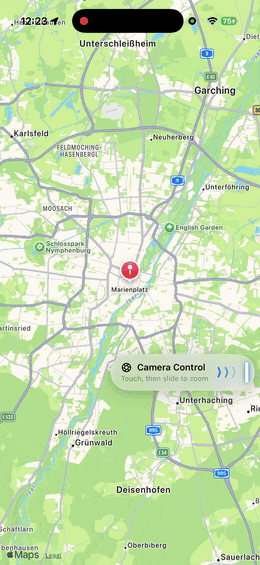

# Camera Control Map SwiftUI Demo
An example of driving a MapKit map's zoom with the iPhone Camera Control button, powered by a custom AVCaptureSlider.
Developed entirely natively using Swift and SwiftUI.

## Installation
All dependencies are managed by SPM automatically.

## Build
No additional setup is needed. Build project using Xcode.

## Technologies
* Swift
* SwiftUI
* MapKit
* AVFoundation (Camera Control)

## Requirements
* iOS 18.0+ device with the Camera Control button for the hardware zoom
* Camera permission (used only to expose the control, no feed is captured)

## Versions
* Xcode 26.6 (latest)
* Swift 6

## Branches
GitFlow is strictly enforced on this repository. [GitFlow](https://www.atlassian.com/git/tutorials/comparing-workflows/gitflow-workflow)

### Branch overview
* master
* develop
* feature/name
* hotfix/name

### Git Flow:
feature -> develop -> master

## License
Copyright © August 29, 2026 Konstantin Stolyarenko. All rights reserved.
